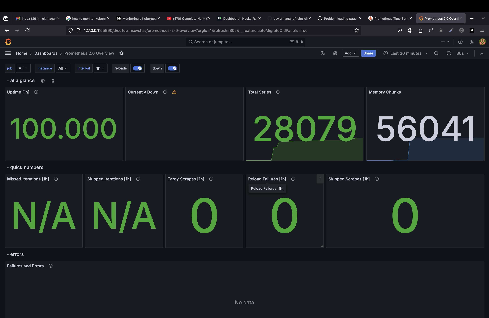
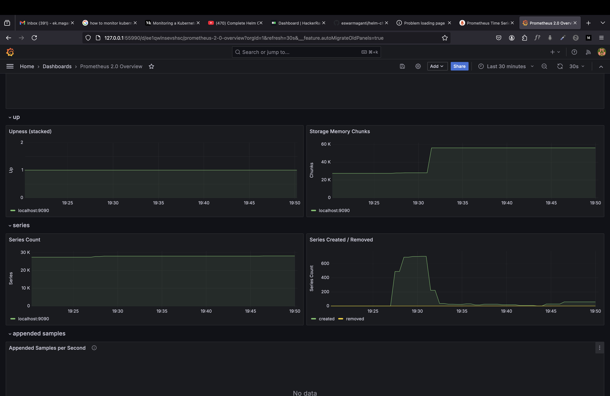
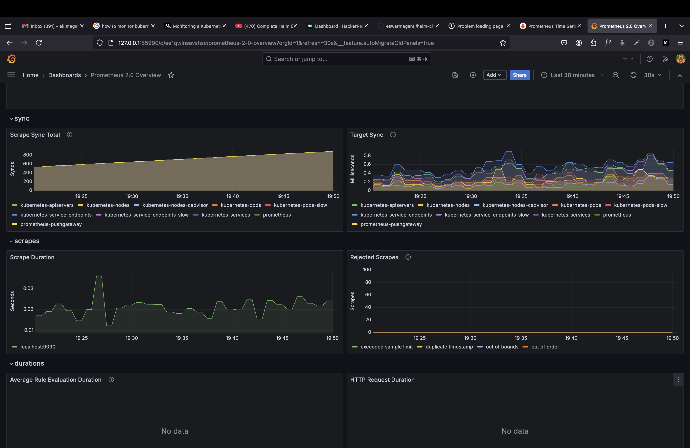
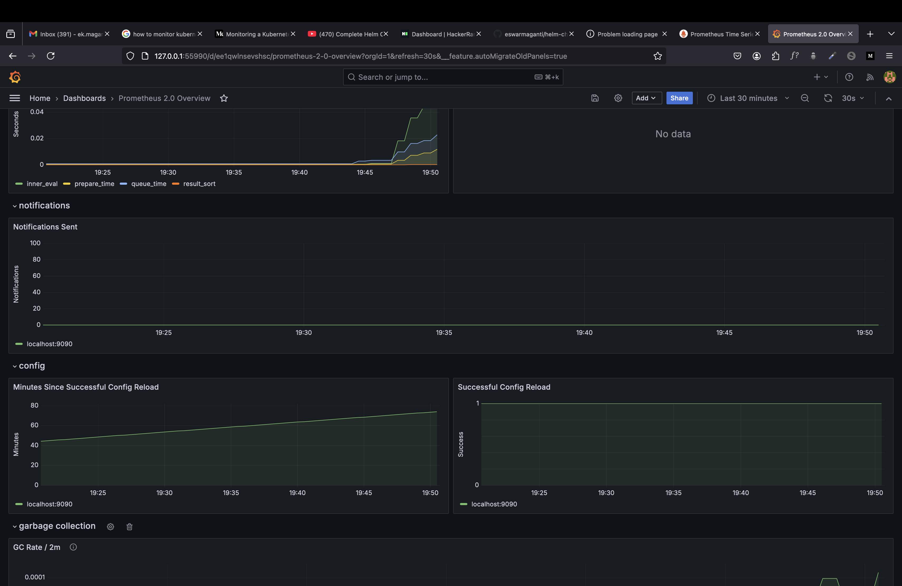

# Configuring Monitoring in Kubernetes Cluster using Prometheus & Grafana

## Installing Prometheus in minikube cluster
1. Start the Minikube Cluster
    - `minikube start`   
    Output:
        ```
            😄  minikube v1.33.1 on Darwin 15.0.1 (arm64)
            🎉  minikube 1.34.0 is available! Download it: https://github.com/kubernetes/minikube/releases/tag/v1.34.0
            💡  To disable this notice, run: 'minikube config set WantUpdateNotification false'

            ✨  Using the docker driver based on existing profile
            👍  Starting "minikube" primary control-plane node in "minikube" cluster
            🚜  Pulling base image v0.0.44 ...
            🔄  Restarting existing docker container for "minikube" ...
            🐳  Preparing Kubernetes v1.30.0 on Docker 26.1.1 ...
            🔎  Verifying Kubernetes components...
                ▪ Using image docker.io/kubernetesui/dashboard:v2.7.0
                ▪ Using image gcr.io/k8s-minikube/storage-provisioner:v5
                ▪ Using image docker.io/kubernetesui/metrics-scraper:v1.0.8
            💡  Some dashboard features require the metrics-server addon. To enable all features please run:

                minikube addons enable metrics-server

            🌟  Enabled addons: default-storageclass, storage-provisioner, dashboard
            🏄  Done! kubectl is now configured to use "minikube" cluster and "default" namespace by default
        ```

2. Install Helm Charts using brew package manager
    - `brew install helm`   
    Output:
        ```
            ==> Downloading https://formulae.brew.sh/api/formula.jws.json
            ############################################################################################# 100.0%
            ==> Downloading https://formulae.brew.sh/api/cask.jws.json
            ############################################################################################# 100.0%
            ==> Downloading https://ghcr.io/v2/homebrew/core/helm/manifests/3.16.2
            ############################################################################################# 100.0%
            ==> Fetching helm
            ==> Downloading https://ghcr.io/v2/homebrew/core/helm/blobs/sha256:13ad3314a8d2eda0a9fdc822adb711710
            ############################################################################################# 100.0%
            ==> Pouring helm--3.16.2.arm64_sequoia.bottle.tar.gz
            ==> Caveats
            zsh completions have been installed to:
            /opt/homebrew/share/zsh/site-functions
            ==> Summary
            🍺  /opt/homebrew/Cellar/helm/3.16.2: 66 files, 55.4MB
            ==> Running `brew cleanup helm`...
            Disable this behaviour by setting HOMEBREW_NO_INSTALL_CLEANUP.
            Hide these hints with HOMEBREW_NO_ENV_HINTS (see `man brew`).
        ```

3. Create a kubernetes namespace to install prometheus
    - `kubectl create namespace monitoring`   
    Output:
        ```
            namespace/monitoring created
        ```

4. Add the prometheus repository to the kuberbetes cluster
    -  `helm repo add prometheus-community https://prometheus-community.github.io/helm-charts`   
    Output:
        ```
            helm repo add prometheus-community https://prometheus-community.github.io/helm-charts
        ```
5. Updating the helm repos
    - `helm repo update`
6. Installing Promotheus under monitoring namespace
    - `helm install prometheus prometheus-community/prometheus --namespace monitoring`   
    Output:
        ```
            NAME: prometheus
            LAST DEPLOYED: Wed Oct 23 18:32:55 2024
            NAMESPACE: monitoring
            STATUS: deployed
            REVISION: 1
            TEST SUITE: None
            NOTES:
            The Prometheus server can be accessed via port 80 on the following DNS name from within your cluster:
            prometheus-server.monitoring.svc.cluster.local


            Get the Prometheus server URL by running these commands in the same shell:
            export POD_NAME=$(kubectl get pods --namespace monitoring -l "app.kubernetes.io/name=prometheus,app.kubernetes.io/instance=prometheus" -o jsonpath="{.items[0].metadata.name}")
            kubectl --namespace monitoring port-forward $POD_NAME 9090


            The Prometheus alertmanager can be accessed via port 9093 on the following DNS name from within your cluster:
            prometheus-alertmanager.monitoring.svc.cluster.local


            Get the Alertmanager URL by running these commands in the same shell:
            export POD_NAME=$(kubectl get pods --namespace monitoring -l "app.kubernetes.io/name=alertmanager,app.kubernetes.io/instance=prometheus" -o jsonpath="{.items[0].metadata.name}")
            kubectl --namespace monitoring port-forward $POD_NAME 9093
            #################################################################################
            ######   WARNING: Pod Security Policy has been disabled by default since    #####
            ######            it deprecated after k8s 1.25+. use                        #####
            ######            (index .Values "prometheus-node-exporter" "rbac"          #####
            ###### .          "pspEnabled") with (index .Values                         #####
            ######            "prometheus-node-exporter" "rbac" "pspAnnotations")       #####
            ######            in case you still need it.                                #####
            #################################################################################


            The Prometheus PushGateway can be accessed via port 9091 on the following DNS name from within your cluster:
            prometheus-prometheus-pushgateway.monitoring.svc.cluster.local


            Get the PushGateway URL by running these commands in the same shell:
            export POD_NAME=$(kubectl get pods --namespace monitoring -l "app=prometheus-pushgateway,component=pushgateway" -o jsonpath="{.items[0].metadata.name}")
            kubectl --namespace monitoring port-forward $POD_NAME 9091

            For more information on running Prometheus, visit:
            https://prometheus.io/
        ```
7. List the pods under kubernetes namespace
    - `kubectl get pods --namespace monitoring` 
    Output:
        ```
            NAME                                                READY   STATUS    RESTARTS   AGE
            prometheus-alertmanager-0                           1/1     Running   0          21m
            prometheus-kube-state-metrics-74cdb59bff-5rwg2      1/1     Running   0          21m
            prometheus-prometheus-node-exporter-gn8tr           1/1     Running   0          21m
            prometheus-prometheus-pushgateway-66fc55f8d-qddlr   1/1     Running   0          21m
            prometheus-server-dd484f8d9-b5jk4                   2/2     Running   0          21m
        ```
8. List the kubernestes service under monitoring namespace
    - `kubectl get svc --namespace monitoring`
    Output:
        ```
            NAME                                  TYPE        CLUSTER-IP       EXTERNAL-IP   PORT(S)    AGE
            prometheus-alertmanager               ClusterIP   10.100.220.84    <none>        9093/TCP   27m
            prometheus-alertmanager-headless      ClusterIP   None             <none>        9093/TCP   27m
            prometheus-kube-state-metrics         ClusterIP   10.101.81.119    <none>        8080/TCP   27m
            prometheus-prometheus-node-exporter   ClusterIP   10.101.152.115   <none>        9100/TCP   27m
            prometheus-prometheus-pushgateway     ClusterIP   10.106.240.242   <none>        9091/TCP   27m
            prometheus-server                     ClusterIP   10.99.71.248     <none>        80/TCP     27m
        ```
9. Expose the Prometheus Server Pod as a service using type NodePort
    - `kubectl expose service prometheus-server --namespace monitoring --type=NodePort --target-port=9090 --name=prometheus-server-ext`   
    Output:
        ```
            service/prometheus-server-ext exposed
        ```
10. Access the prometheus server by exposing using minikube 
    - `minikube service prometheus-server-ext`   
    Output: 
        ```
        |------------|-----------------------|-------------|---------------------------|
        | NAMESPACE  |         NAME          | TARGET PORT |            URL            |
        |------------|-----------------------|-------------|---------------------------|
        | monitoring | prometheus-server-ext |          80 | http://192.168.49.2:32489 |
        |------------|-----------------------|-------------|---------------------------|
        🏃  Starting tunnel for service prometheus-server-ext.
        |------------|-----------------------|-------------|------------------------|
        | NAMESPACE  |         NAME          | TARGET PORT |          URL           |
        |------------|-----------------------|-------------|------------------------|
        | monitoring | prometheus-server-ext |             | http://127.0.0.1:54770 |
        |------------|-----------------------|-------------|------------------------|
        🎉  Opening service monitoring/prometheus-server-ext in default browser...
        ❗  Because you are using a Docker driver on darwin, the terminal needs to be open to run it.

        ```

## Installing Grafana in minikube cluster
1. Add the grafana helm repo in cluster
    - `helm add repo grafana https://grafana.github.io/helm-charts`   
    Output:
        ```
            "grafana" has been added to your repositories
        ```
2. Installing the grafana under namespace monitoring
    - `helm install grafana grafana/grafana --namespace monitoring`   
    Output:
        ```
            NAME: grafana
            LAST DEPLOYED: Wed Oct 23 19:26:38 2024
            NAMESPACE: monitoring
            STATUS: deployed
            REVISION: 1
            NOTES:
            1. Get your 'admin' user password by running:

            kubectl get secret --namespace monitoring grafana -o jsonpath="{.data.admin-password}" | base64 --decode ; echo


            2. The Grafana server can be accessed via port 80 on the following DNS name from within your cluster:

            grafana.monitoring.svc.cluster.local

            Get the Grafana URL to visit by running these commands in the same shell:
                export POD_NAME=$(kubectl get pods --namespace monitoring -l "app.kubernetes.io/name=grafana,app.kubernetes.io/instance=grafana" -o jsonpath="{.items[0].metadata.name}")
                kubectl --namespace monitoring port-forward $POD_NAME 3000

            3. Login with the password from step 1 and the username: admin
            #################################################################################
            ######   WARNING: Persistence is disabled!!! You will lose your data when   #####
            ######            the Grafana pod is terminated.                            #####
            #################################################################################
        ```
3. Fetching the password of grafana from secrets
    - `kubectl get secret --namespace monitoring grafana -o jsonpath="{.data.admin-password}" | base64 --decode ; echo`   
    Output:
        ```
            gHcNIsBnqTKtVN9m8rmN7Her7uiHHYzvfdIoi3ZH
        ```
4. List the services under monitoring namespace and check the grafana service
    - `kubectl get svc --namespace monitoring`   
    Output:
        ```
           NAME                                  TYPE        CLUSTER-IP       EXTERNAL-IP   PORT(S)        AGE
            grafana                               ClusterIP   10.109.36.158    <none>        80/TCP         5m17s
            prometheus-alertmanager               ClusterIP   10.100.220.84    <none>        9093/TCP       59m
            prometheus-alertmanager-headless      ClusterIP   None             <none>        9093/TCP       59m
            prometheus-kube-state-metrics         ClusterIP   10.101.81.119    <none>        8080/TCP       59m
            prometheus-prometheus-node-exporter   ClusterIP   10.101.152.115   <none>        9100/TCP       59m
            prometheus-prometheus-pushgateway     ClusterIP   10.106.240.242   <none>        9091/TCP       59m
            prometheus-server                     ClusterIP   10.99.71.248     <none>        80/TCP         59m
            prometheus-server-ext                 NodePort    10.98.178.30     <none>        80:32489/TCP   27m 
        ```

5. Expose the Grafana as a service of type NodePort
    - `kubectl expose grafana --namespace monitoring --type=NodePort --target-port=3000 --name=grafana-ext`   
    Output:
        ```
            service/grafana-ext exposed
        ```
6. Access the exposed grafana service using minikube proxy tunneling
    - `minikube service grafana-ext`   
    Output:
        ```
            |------------|-------------|-------------|---------------------------|
            | NAMESPACE  |    NAME     | TARGET PORT |            URL            |
            |------------|-------------|-------------|---------------------------|
            | monitoring | grafana-ext |          80 | http://192.168.49.2:32129 |
            |------------|-------------|-------------|---------------------------|
            🏃  Starting tunnel for service grafana-ext.
            |------------|-------------|-------------|------------------------|
            | NAMESPACE  |    NAME     | TARGET PORT |          URL           |
            |------------|-------------|-------------|------------------------|
            | monitoring | grafana-ext |             | http://127.0.0.1:55990 |
            |------------|-------------|-------------|------------------------|
            🎉  Opening service monitoring/grafana-ext in default browser...
            ❗  Because you are using a Docker driver on darwin, the terminal needs to be open to run it.

        ```
7. Creating a Dashboard in Grafana
    - Configure the Prometheous as a Data Source for the grafana dashboard.
    - Import a dashboard from grafana using id 3662, we can able to view the metrics in grafana .
    - 
    - 
    - 
    - 

